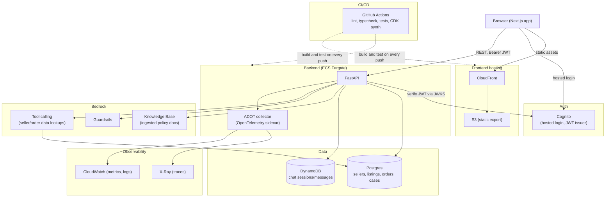

# Seller Support Copilot

An AI support assistant that helps e-commerce sellers get answers about marketplace policies, their orders, and their listings.

> **Work in progress.** 

## Architecture

The diagram below shows the target architecture.


```mermaid
flowchart TB
    Browser["Browser (Next.js app)"]

    subgraph FrontendHosting["Frontend hosting"]
        CF["CloudFront"]
        S3W["S3 (static export)"]
    end

    subgraph AuthLayer["Auth"]
        Cognito["Cognito<br/>(hosted login, JWT issuer)"]
    end

    subgraph Backend["Backend (ECS Fargate)"]
        API["FastAPI"]
        ADOT["ADOT collector<br/>(OpenTelemetry sidecar)"]
    end

    subgraph DataLayer["Data"]
        PG[("Postgres<br/>sellers, listings, orders, cases")]
        DDB[("DynamoDB<br/>chat sessions/messages")]
    end

    subgraph AI["Bedrock"]
        KB["Knowledge Base<br/>(ingested policy docs)"]
        GR["Guardrails"]
        Tools["Tool calling<br/>(seller/order data lookups)"]
    end

    subgraph Obs["Observability"]
        XRay["X-Ray (traces)"]
        CW["CloudWatch (metrics, logs)"]
    end

    subgraph CICD["CI/CD"]
        GHA["GitHub Actions<br/>lint, typecheck, tests, CDK synth"]
    end

    Browser -->|static assets| CF --> S3W
    Browser -->|hosted login| Cognito
    Browser -->|REST, Bearer JWT| API
    API -->|verify JWT via JWKS| Cognito
    API --> PG
    API --> DDB
    API --> KB
    API --> GR
    API --> Tools
    Tools --> PG
    API --> ADOT
    ADOT --> XRay
    ADOT --> CW
    GHA -.->|build and test on every push| Backend
    GHA -.->|build and test on every push| FrontendHosting
```

Current state: the browser talks to a FastAPI service backed by Postgres and DynamoDB (both run locally in Docker), and sign-in uses a real Amazon Cognito user pool.

## Tech stack

- **Frontend**: Next.js (App Router, static export), TypeScript, Tailwind CSS v4, TanStack Query, oidc-client-ts, Vitest + React Testing Library
- **Backend**: FastAPI (Python 3.12), SQLAlchemy 2.0 + Alembic, Pydantic v2, pytest
- **Data**: Postgres (relational: sellers, listings, orders, order_items, support_cases), DynamoDB (chat sessions/messages)
- **Auth**: Amazon Cognito (Authorization Code + PKCE, JWT verified in-process against JWKS)
- **AI**: Amazon Bedrock, Knowledge Bases, Guardrails, tool calling, structured outputs
- **Observability**: OpenTelemetry, ADOT collector, CloudWatch, X-Ray
- **Infra**: Docker Compose (local), AWS CDK (infra/, budget alert stack)
- **CI/CD**: GitHub Actions (lint, typecheck, unit and integration tests, Docker build check, CDK synth on every push)

See [DECISIONS.md](DECISIONS.md) for why each of these was chosen and what was rejected.

## Roadmap

| Phase | Delivers |
| --- | --- |
| 0 | Monorepo scaffolding: repo layout, Docker Compose (Postgres, DynamoDB Local, API), GitHub Actions CI skeleton, CDK `BudgetStack` for cost alerts |
| 1 | Data layer: Postgres schema (sellers, listings, orders, order_items, support_cases) via SQLAlchemy + Alembic, DynamoDB chat store, deterministic seed script, refund-request service with row-level locking |
| 2 | API: Cognito JWT verification and role-based access, REST endpoints under `/v1`, RFC 9457 `application/problem+json` errors, OpenAPI contract exported and checked in CI, 85% coverage gate |
| 3 | Frontend: Next.js static export, Cognito Authorization Code + PKCE login, generated TypeScript API client, seller and admin pages (orders, cases, chat, admin case queue), accessibility (Lighthouse 100/100 on the pages audited), Vitest test suite |
| 4 | Bedrock: Knowledge Base retrieval over ingested policy docs, Guardrails, tool calling against seller/order data, structured outputs |
| 5 | Eval harness: golden question set with expected facts, run on demand and gating CI on regression |
| 6 | Observability: OpenTelemetry instrumentation in the API, ADOT sidecar forwarding traces to X-Ray and metrics/logs to CloudWatch |
| 7 | End-to-end tests: Playwright driving the web app in a real browser |
| 8 | Deploy: FastAPI on ECS Fargate behind an ALB, Next.js static export on S3 + CloudFront |
| 9 | Results: measure and report p95 latency, cost per query, eval pass rate, and final test coverage against the deployed system |
| Stretch | SQS for async policy-document ingestion, CDK for infra beyond the budget stack, a Lambda ingestion worker, rate limiting at the API Gateway/WAF layer. Redis was evaluated and cut (no measured hot path to justify it); see [DECISIONS.md](DECISIONS.md#cut-or-deferred). |

## Design decisions

Every non-obvious choice in this repo, what it does, why it was chosen over the alternatives, the tradeoff accepted, and when to revisit it, is recorded in [DECISIONS.md](DECISIONS.md). That includes FastAPI, Postgres, the DynamoDB key design, Cognito, keyset pagination, the admin case queue's ordering, oidc-client-ts, TanStack Query, and more.


## Repository layout

| Path | What |
| --- | --- |
| `apps/web` | Next.js frontend (static export for S3 + CloudFront) |
| `services/api` | FastAPI backend |
| `services/ingest` | Document ingestion pipeline (placeholder) |
| `packages/api-client` | TypeScript API client generated from `services/api/openapi.json` |
| `infra` | AWS CDK app (currently `BudgetStack` only; not deployed by CI) |
| `evals` | Evaluation datasets and scripts (placeholder) |
| `data` | Synthetic sample data, including the fictional marketplace's policy docs used by seeding and the Bedrock Knowledge Base |
| `DECISIONS.md` | What each component does, why it was chosen, and what was rejected |

## How to run locally

### Prerequisites

- Docker (with Compose v2)
- Python 3.12 and [uv](https://docs.astral.sh/uv/)
- Node 24 (see `.nvmrc`); pnpm via corepack (`corepack pnpm`, or `corepack enable`)
- Optional: [pre-commit](https://pre-commit.com/) (`pre-commit install`)

### Backend

```bash
make up             # Postgres, DynamoDB Local, API on :8000 (docker compose, rebuilds the API image)
make migrate         # apply Alembic migrations
make dynamodb-init   # create the local "chat" DynamoDB table
make seed            # deterministic synthetic sellers/listings/orders/cases (refuses if APP_ENV=prod)
make link-user EMAIL=<seed seller email> SUB=<cognito sub>   # link a seeded seller to a real Cognito user for local login
```

### Frontend

```bash
corepack pnpm install                          # from the repo root (pnpm workspace)
cp apps/web/.env.example apps/web/.env.local    # fill in Cognito values
corepack pnpm --filter @copilot/web run dev     # http://localhost:3000, needs the API running
```

### Run against real AWS (local app, AWS-managed Cognito and Bedrock)

The web app and API run on your machine. Sign-in goes through the deployed Cognito user pool (`AuthStack`) and answers come from the deployed Bedrock Knowledge Base (`KnowledgeBaseStack`). The API uses **your own AWS session** (`aws login`) for Bedrock, and nothing is deployed by these steps. Prerequisites:
- both stacks are deployed
- a Cognito user exists (`make auth-create-user EMAIL=... GROUP=seller`)
- Docker is running

```bash
aws login                      # fresh session; the API on the host uses it for Bedrock
make live-env                  # writes services/api/.env + apps/web/.env.local from the stack outputs (gitignored)
make dev-live                  # Postgres + DynamoDB Local in Docker, migrate, table init, seed once, API on :8000
```

In a second terminal:

```bash
make link-user EMAIL=fwilson@johnson.com SUB=<your Cognito sub>   # once: maps your login to a seed seller
cd apps/web && corepack pnpm dev                                    # http://localhost:3000
```

`make dev-live` starts only Postgres and DynamoDB Local; it doesn't build the API image. DynamoDB Local runs with `-sharedDb`, so the table that `make dynamodb-init` creates with dummy keys is visible to the API's real session keys. The CSP isn't applied under `next dev`; it only applies to the production build. Limits of this setup are listed in DECISIONS.md, under Known open issues.

### Local end-to-end run (verified 2026-10-29)

Run with the steps above (local web app and API, deployed Cognito user pool and Bedrock Knowledge Base). The reviewer checked the screenshots:

- **Sign-in:** the Cognito hosted-UI sign-in as the seller test user worked, and the nav showed the signed-in user.
- **Answerable question:** "How many days does a buyer have to request a refund?" was answered "A buyer can request a refund within **30 days** of the order's delivery date [1]..." with one source. That matches `returns-and-refunds.md`.
- **Off-topic question:** "What is the capital of France?" got the exact refusal message from `rag/prompt.py`. Retrieval scored below `rag_min_score` (0.55), so the model was never called.
- **Admin sign-in:** an admin test user (created with `make auth-create-user ... GROUP=admin`) signed in from a private window, landed on `/admin/cases`, and saw cases across many sellers.
- **Seller blocked from admin:** a seller visiting `/admin/cases` saw "This page is only available to admins". That's the frontend gate, so no API call was made. The API's server-side 403 for non-admins is covered by pytest integration tests (`services/api/tests/integration/test_api_admin.py`) with locally signed test keys, but wasn't exercised with a real Cognito token.

Honest limits of this run:
- The app isn't deployed to AWS. Only Cognito and the Bedrock Knowledge Base are AWS-managed.
- The local API uses the developer's own AWS credentials, so a least-privilege runtime role isn't exercised.
- No Secrets Manager: this setup has no application secret.

Known UI issues found during the run (DECISIONS.md, Known open issues):
- "New session" is disabled, with no hint, until a title is typed.
- Answer markdown renders as literal asterisks.
- Citation snippets show the parent chunk's intro, not the sentence that supports the answer.
- After sign-out, seller pages show the raw API error "missing bearer token" instead of a sign-in prompt.
- After sign-out, Sign in appeared to skip the login form (unconfirmed; see DECISIONS.md).

### Checks

```bash
make lint               # ruff (api) + eslint (web)
make typecheck           # mypy (api) + tsc (api-client, web) + CDK build (infra)
make test                # unit tests: pytest (api, no external deps) + CDK tests
make test-integration    # integration tests: pytest -m integration (needs `make up`)
make coverage            # unit + integration coverage for services/api; fails under 85%
make openapi-check       # fails if openapi.json is stale
make api-client-check    # fails if the generated TS client is stale
corepack pnpm --filter @copilot/web run test    # Vitest
```

Other targets: `make down` (stop containers, keeps the Postgres volume), `make openapi` / `make api-client` (regenerate without the drift check).

## Cost and teardown

- Local development costs nothing. `make down` stops containers; `docker compose down -v` also deletes the Postgres volume.
- Nothing is deployed to AWS automatically. CI only runs `cdk synth`.
- Deploy the budget first so spend is tracked from day one (default 25 USD/month, email alerts at 50%, 80%, 100% actual and 100% forecasted):
  `cd infra && npx cdk deploy BudgetStack -c budgetEmail=you@example.com`
- Teardown: `cd infra && npx cdk destroy --all -c budgetEmail=you@example.com`. Bedrock, databases and Fargate are billable; destroy them when not in use.

## Results

| Metric | Value |
| --- | --- |
| Backend tests | 83 passing |
| Backend coverage | 90% (CI gate: 85%) |
| Frontend tests | 50 passing (Vitest) |
| Accessibility | Lighthouse 100/100 on the audited pages |
| CI | 4 jobs (api, web, infra, api-image), about 1 minute 15 seconds per run |
| Seed data | about 20 sellers, 60+ listings, 500 orders |

### RAG chat (retrieval and answers)

Measured on 2026-10-29 with live Amazon Bedrock calls: Knowledge Base retrieval with hierarchical chunking, answers from Claude Haiku 4.5 via the `us.` inference profile, `rag_min_score` 0.55.

| Metric | Value |
| --- | --- |
| Retrieval hit@1 / hit@5, source-level | 95% / 100% (20 in-scope questions) |
| Retrieval hit@1 / hit@5, fact-level (a retrieved chunk contains the expected fact) | 95% / 100% |
| Answers, in-scope (expected fact stated and expected source cited) | 20/20 |
| Answers, out-of-scope (refusal with zero citations) | 9/10. The one miss was a safe refusal worded outside the scorer's pattern. |
| Cost per answer (estimate) | about $0.0022: Converse tokens at Bedrock on-demand Haiku 4.5 Geo pricing, excluding retrieval |

Caveats: 30 questions (20 in-scope, 10 out-of-scope), written by the same author as the policy documents, so expect these numbers to be optimistic compared with real seller questions. Scoring is deterministic (key-term and citation checks, no LLM judge). Methodology, scoring rules, known limitations and the raw results files are in [evals/README.md](evals/README.md).
